## Как узнать номер счета

### Интернет банкинг

1. Зайти в интернет банкинг

2. Мои Карты

3. Выбрать карту которую будем пополнять

4. Подробнее

5. Номер договора пополнения 

### Интернет банкинг на телефоне

1. Зайти в интернет банкинг

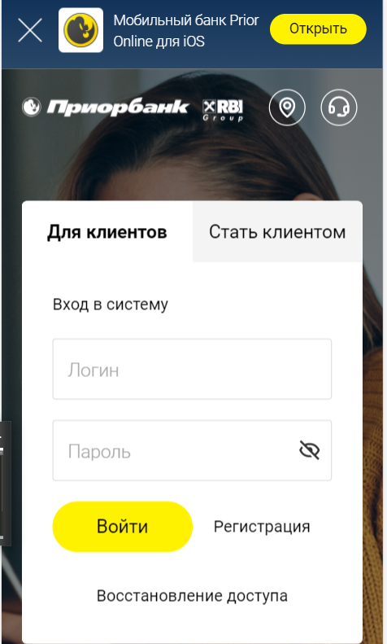

2. Мои Карты

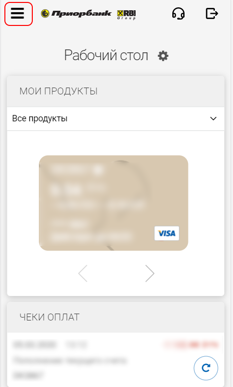

3. Выбрать карту которую будем пополнять

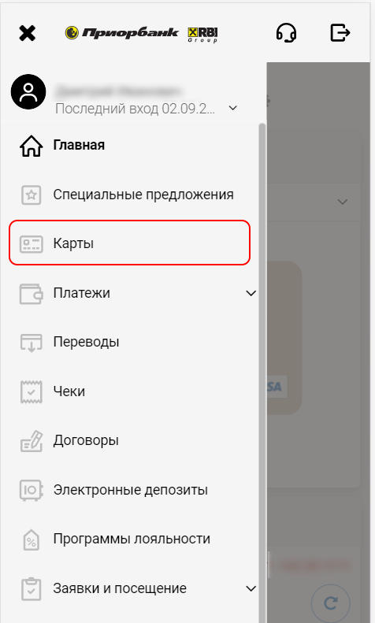

4. Подробнее

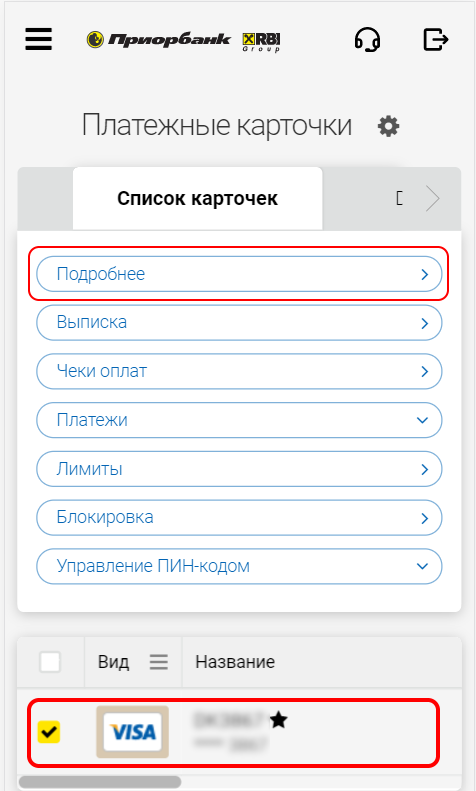

5. Номер договора пополнения 

### Мобильный банкинг Android

1. Зайти в интернет банкинг

2. Мои Карты

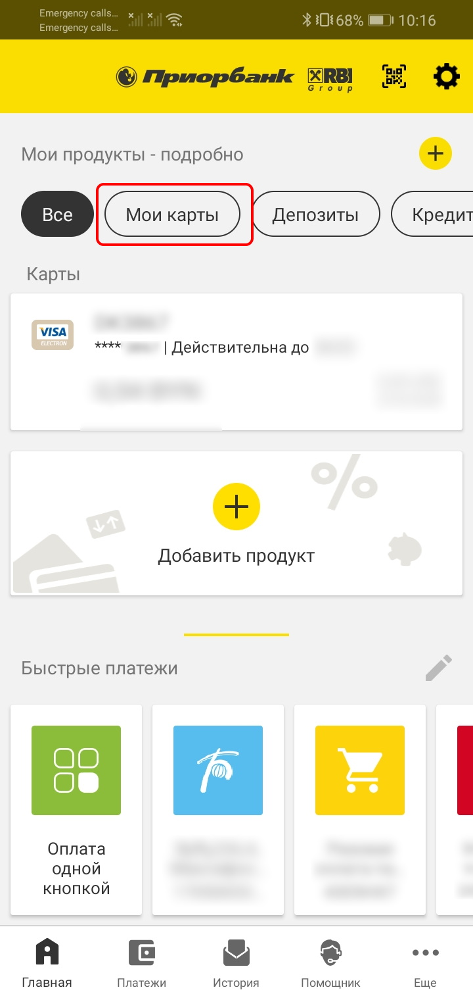

3. Выбрать карту которую будем пополнять

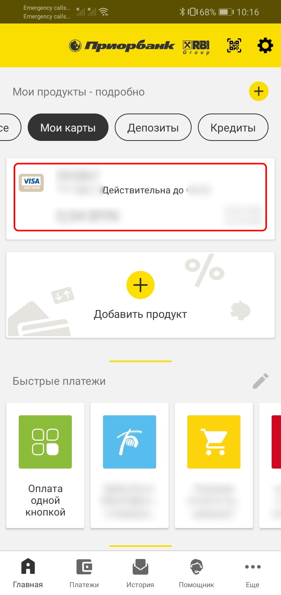

4. Подробнее

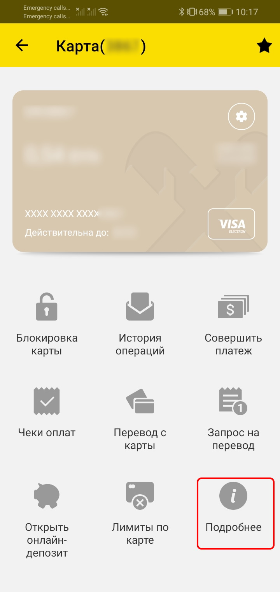

5. Номер договора пополнения 

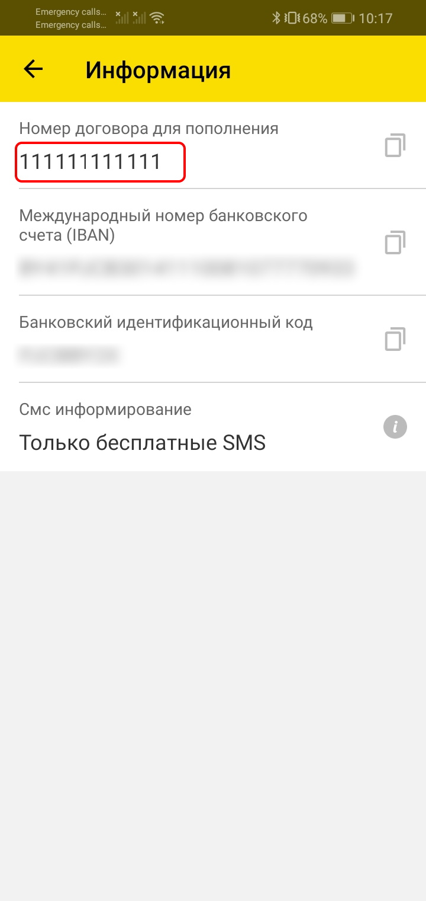

### Мобильный банкинг iphone

1. Зайти в интернет банкинг

2. Мои Карты

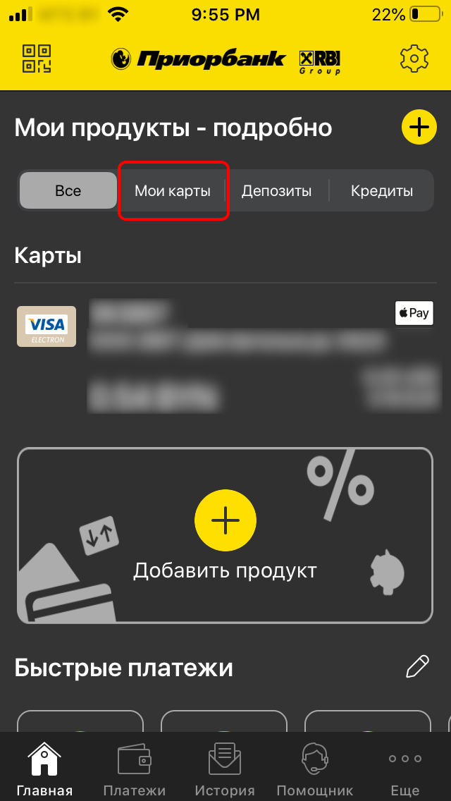

3. Выбрать карту которую будем пополнять

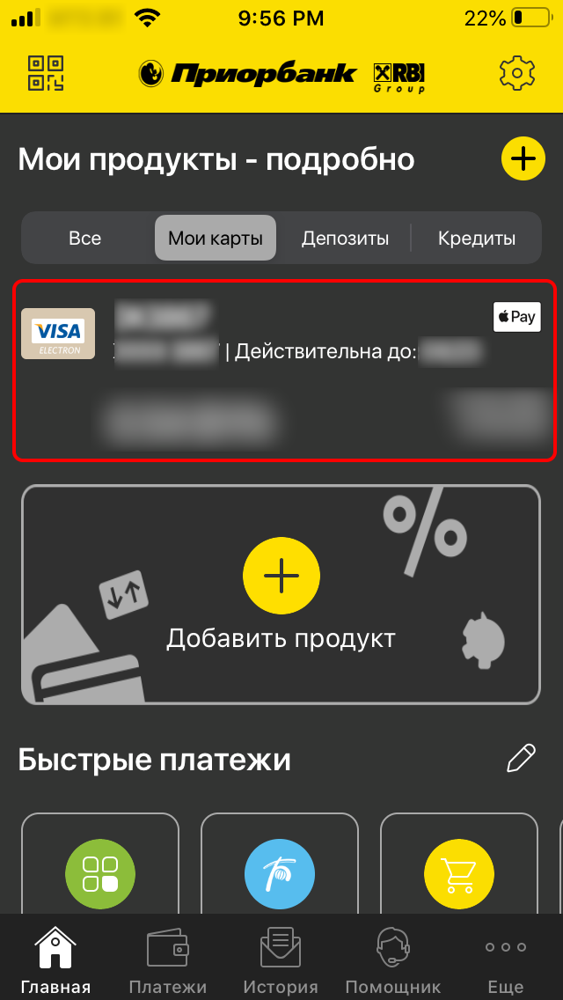

4. Подробнее

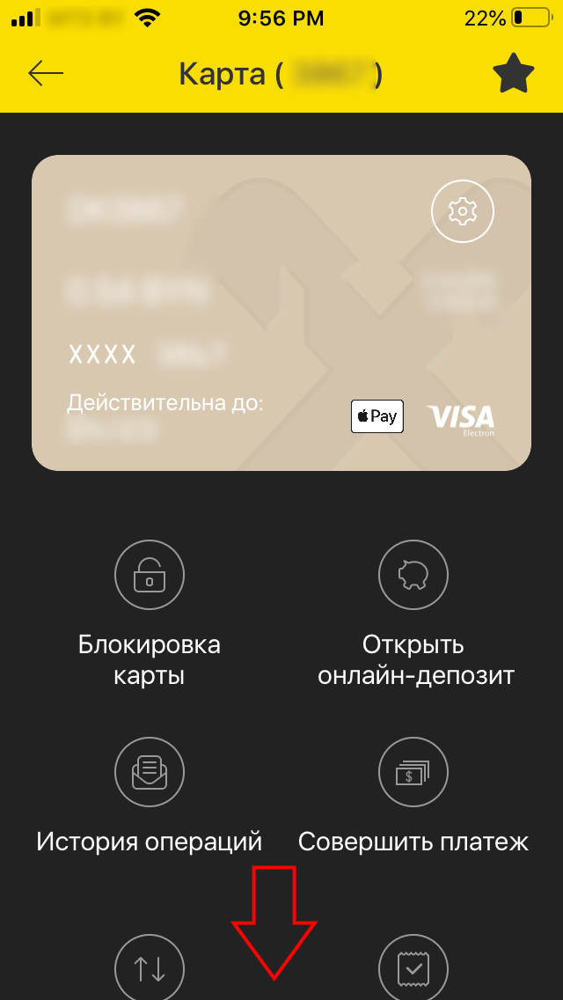

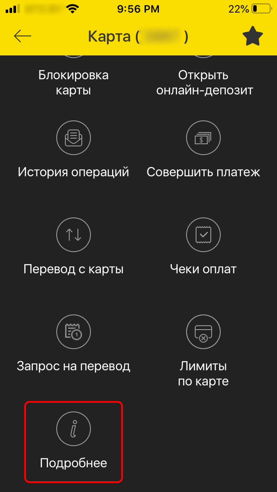

5. Номер договора пополнения 

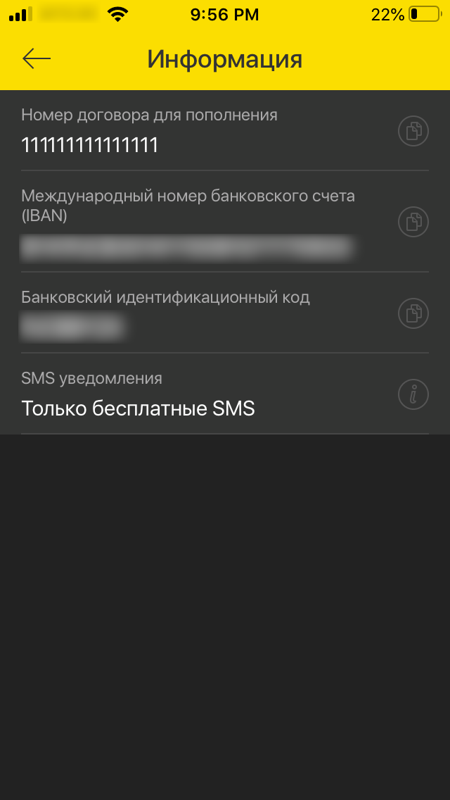

